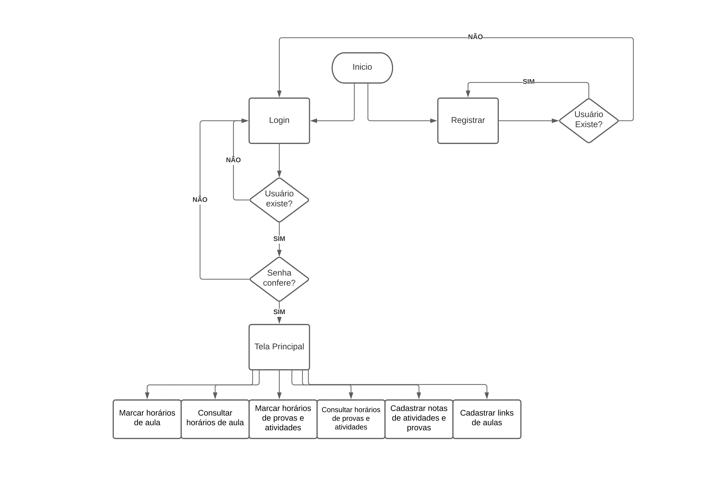

# Organizador Escolar

## Escopo: Organizador Escolar

### Funcionalidades:
* Marcar horários de aula
* Consultar horários de aula
* Marcar horários de provas e atividades
* Consultar horário de provas e atividades
* Cadastrar notas de atividades e provas
* Cadastrar links de aulas

### Time
* [Caio Alexandre Campos Maciel](https://github.com/kaioalex)
* [Eduardo Dias](https://github.com/eduardo2512)
* [João Vitor de Morais Rocha](https://github.com/joaovmr)
* [Luiz Philippe Pereira](https://github.com/luizppa)
   
### Tecnologias
* Frontend: Js (React)
* Backend: Js (Node)
* Debug do backend: Postman
* Banco de dados: MongoDB
* Controle de versão: Git
* Organização: Notion

### Diagrama Arquitetural 

### Backlog do Produto
   [User Stories](https://www.notion.so/4489b796accd47eaa7cbfa46d315466b?v=5abcfbbe05604c30958bb7ac909ed513)

### Backlog do Sprint
   [Board no notion](https://www.notion.so/431c9c8b5bd94165bd0260524a5e6c28?v=fed48de73fb148f0)
